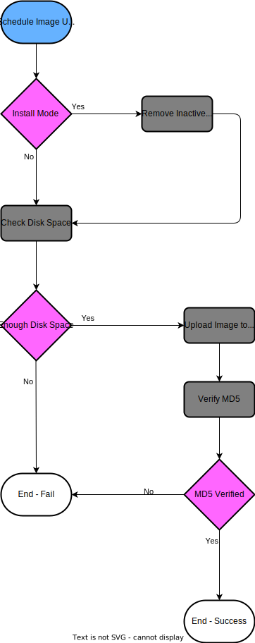
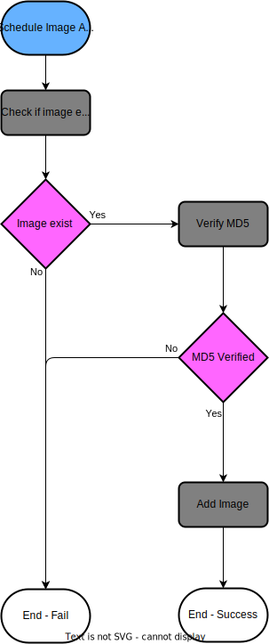
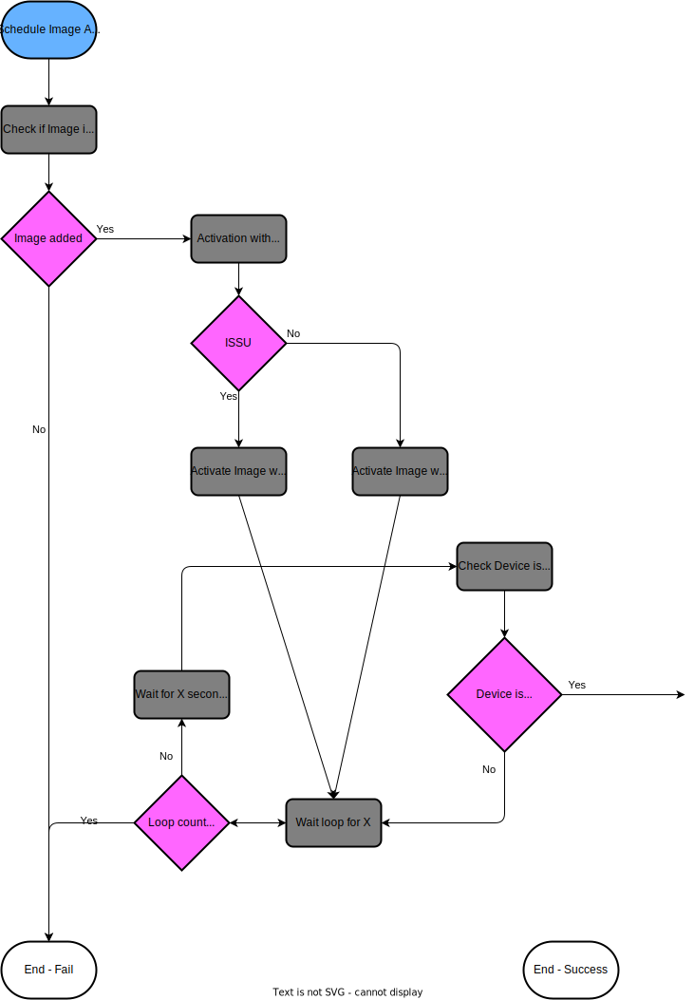

# Netbox Operating System Management

[NetBox](https://github.com/netbox-community/netbox) plugin to manage operating systems on your devices in following aspects:

- assign golden images based on filter attributes like device types, site, location, role
- scheduled upload of the golden image to the device
- scheduled upgrade of the device with pre- and post checks

## Important notes

Thank you to the allready existing [Cisco device software manager](https://github.com/alsigna/netbox-software-manager) for the inspiration. 
Unfortunately the plugin has it's last update on January 2023.

Use this plugin on your own risk! Test the update proccess in a test environment before you switch to your prod environment!

## Image Upload

### Image Upload - Architecture

### Image Upload - Process

## Image Upgrade

### Image Add - Architecture

### Image Add - Process

### Image Activation

### Image Activation - Architecture

### Image Activation - Process

